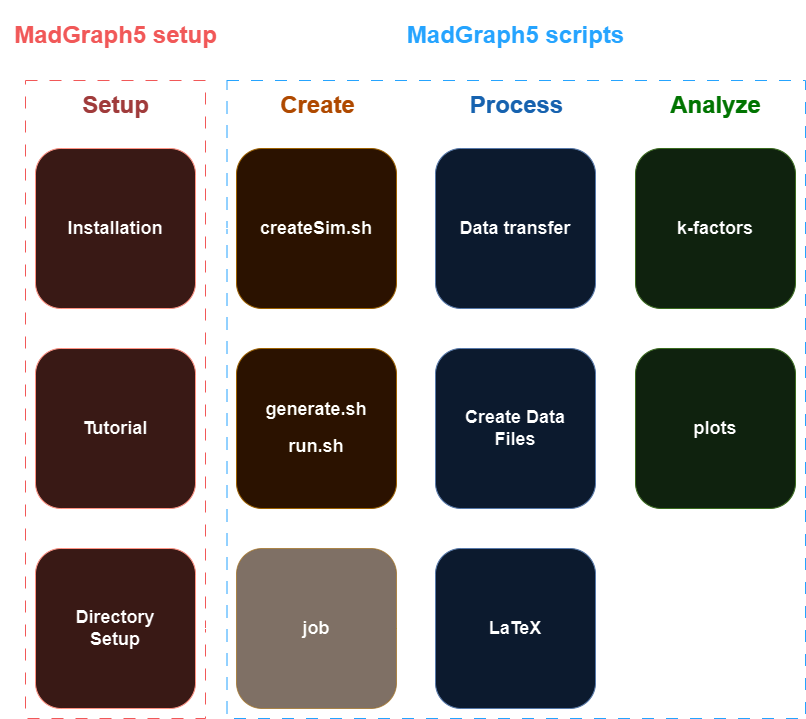

# MadGraph5-scripts   
This project describes my workflow for producing the NLO/LO cross sections and distributions seen in [my first paper](https://arxiv.org/abs/2312.00861). Below is a flow chart of my workflow.

See my [setup guide (work-in-progress)](https://github.com/chrisleefoster/MadGraph5-setup) for installation, tutorial, and directory setup. This guide assumes you are using the setup described there.

## Creating Data
Once mg5 is installed and setup, you can start simulating particle collisions. 

### createSim.sh
Running `ttbarW.sh`(soon to be createSim.sh) will copy the sim directory in `sim.tar.gz` and rename it to ttbarW-date-number, where date is today's date in YYYY_MM_DD and number increases for each sim created on the same day. 

The sim directory contains 5 files:   
- `generate.sh`
- `generate_eW.sh`
- `run.sh`
- `analysis_HwU_distributions.f`
- `job`

### generation scripts
After creating the new sim folder, we can start a simulation by running `path/to/mg5/bin/mg5_aMC generate.sh`. If we want to include electroweak corrections we run `path/to/mg5/bin/mg5_aMC generate_eW.sh`.

#### HPC
If you are running on a HPC cluster using TORQUE, you can run simulations by submitting the job file with `qsub job`. 

## Process Data
Once a simulation is done, the data of interest will be found in `simName/Events/run_01/MADatNLO.HwU`.   
TODO: create script for moving data? (it only takes one command to move to this might be unnecessary).

The two python scripts will pull the data we are interested in from the HwU file into a data file.   

Currently, for distributions, I copy and paste data from the HwU file into an excel spreadsheet for processing and converting to LaTeX.    
TODO: create script for processing distributions

TODO: create script for creating LaTeX tables

## Analyze Data
TODO: add file for calculating k-factors

TODO: create script for plotting in xmgrace
